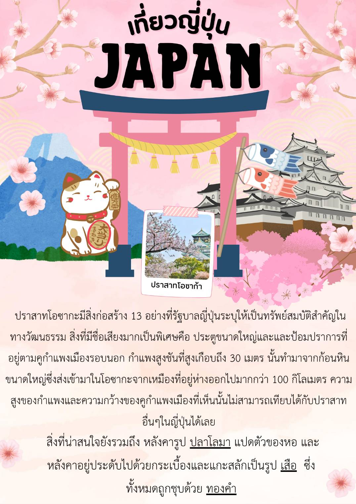
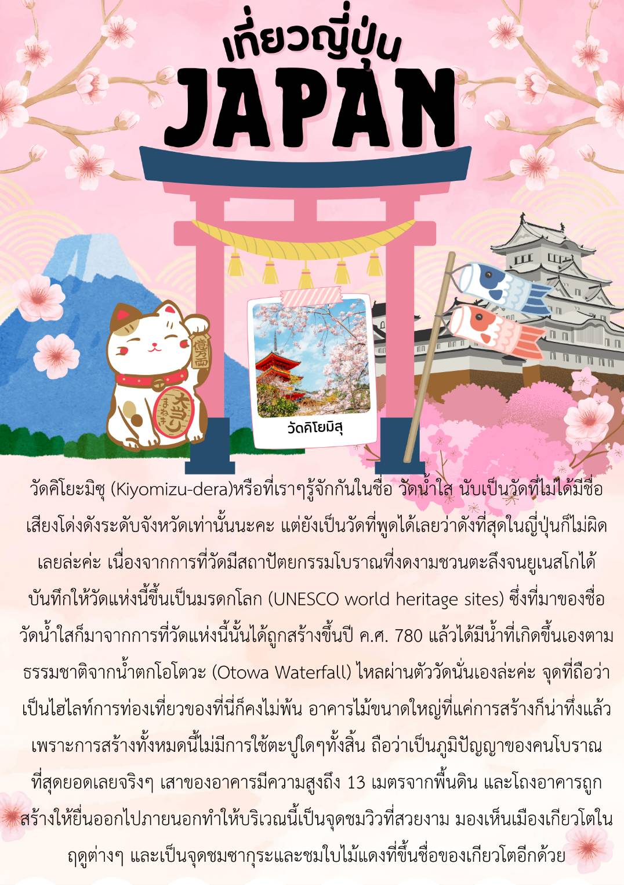
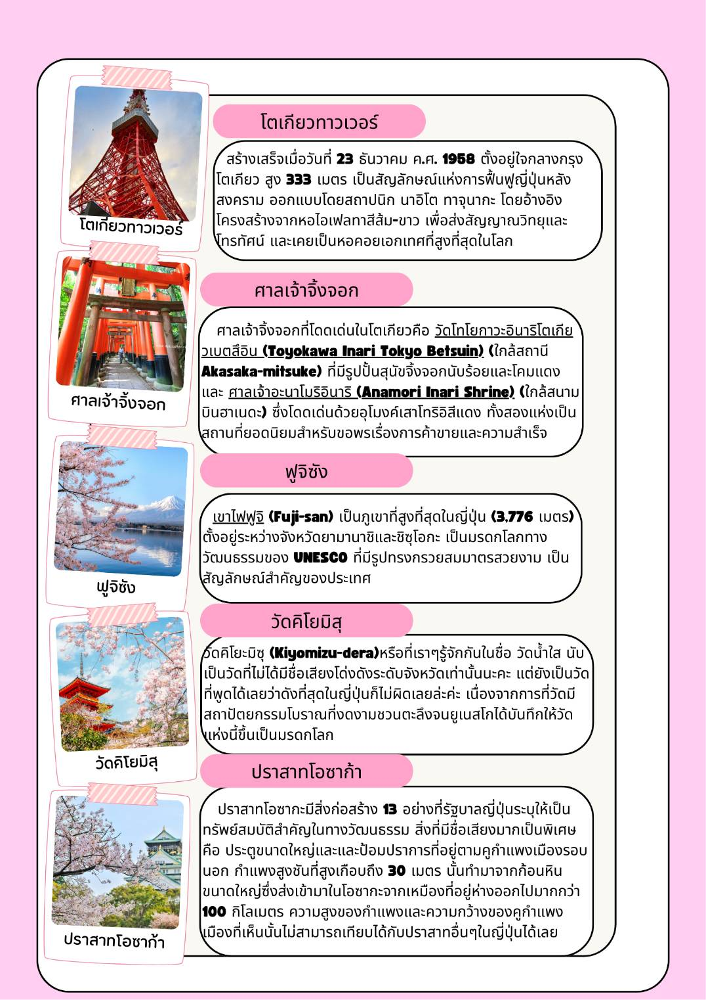

สถานที่ท่องเที่ยวของญี่ปุ่น
    
</body>

</html>
<!DOCTYPE html>
<html lang="en">
<head>
    <meta charset="UTF-8">
    <meta name="viewport" content="width=device-width, initial-scale=1.0">
</head>
<frameset rows="35%,*">
    <frame src="65732.jpg" name="top" noresize scrolling="no">
    <frameset cols="10%,*">
        <frame src="menu.html" name="menu" frameborder="0">
            <frame src="main.html" name="main" frameborder="0">
        </frameset>
</frameset>
<body>
    
</body>
</html><!DOCTYPE html>
<html lang="en">
<head>
    <meta charset="UTF-8">
    <meta name="viewport" content="width=device-width, initial-scale=1.0">
</head>
<body>
    
</body>
</html>
<!DOCTYPE html>
<html lang="en">
<head>
    <meta charset="UTF-8">
    <meta name="viewport" content="width=device-width, initial-scale=1.0">
</head>
<body>
    
</body>

</html>
<!DOCTYPE html>
<html lang="en">
<head>
    <meta charset="UTF-8">
    <meta name="viewport" content="width=device-width, initial-scale=1.0">
</head>
<body>
    
</body>

</html>
<!DOCTYPE html>
<html lang="en">
<head>
    <meta charset="UTF-8">
    <meta name="viewport" content="width=device-width, initial-scale=1.0">
</head>
<body>
    
</body>

</html>
    
